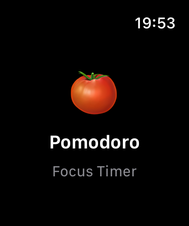
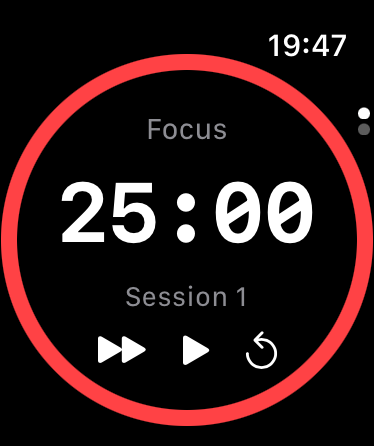
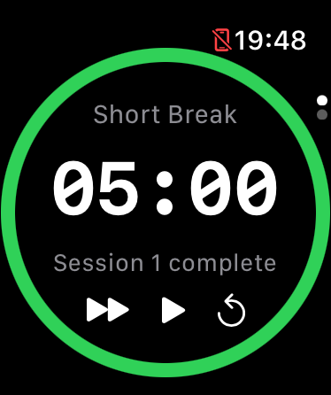
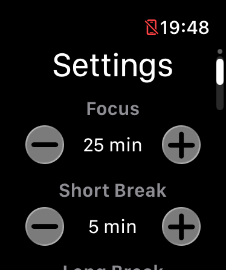
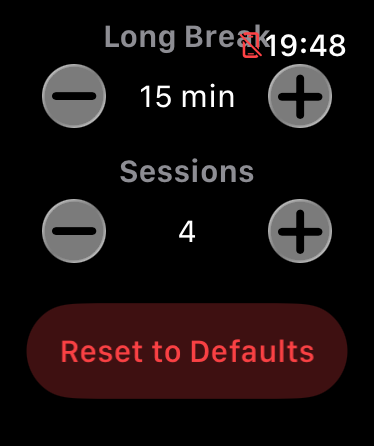

# 🍅 Pomodoro Timer

A native Apple Watch Pomodoro timer built with SwiftUI and WatchKit.

## Overview

Pomodoro Timer helps you stay focused using the [Pomodoro Technique](https://en.wikipedia.org/wiki/Pomodoro_Technique) — 25 minutes of focused work followed by short breaks, with a longer break after every 4 sessions.

## Screenshots
### WatchOS
<p float="left">
    
    
    
    
    
</p>

## Features

- ⏱ Focus, short break, and long break timer cycles
- 💍 Animated circular progress ring with phase color coding
- 🔔 Haptic feedback and local notifications on session completion
- ⚙️ Customizable durations via Settings
- 🔋 Background runtime via `WKExtendedRuntimeSession` — timer keeps running when wrist is lowered
- 🍅 Splash screen on launch

## Platforms

| Platform | Status |
|----------|--------|
| watchOS | ✅ Complete |
| iOS | 🚧 Coming soon |
| macOS | 📋 Planned |

## Requirements

- Xcode 16+
- watchOS 10+
- iOS 17+ (companion app)

## Project Structure

```
PomodoroTimer/
├── Pomodoro Watch App/
│   ├── PomodoroWatchApp.swift   ← entry point
│   ├── RootView.swift           ← splash coordinator
│   ├── ContentView.swift        ← TabView coordinator
│   ├── TimerView.swift          ← timer UI
│   ├── SettingsView.swift       ← customizable durations
│   ├── SplashView.swift         ← launch splash
│   ├── ProgressRing.swift       ← circular progress component
│   ├── TimerManager.swift       ← timer logic + background session
│   └── PomodoroState.swift      ← data model
├── PomodoroWatchAppTests/       ← unit tests
└── PomodoroWatchAppUITests/     ← UI tests
```

## Architecture

- **`PomodoroState`** — pure Swift struct holding all timer state and cycle logic
- **`TimerManager`** — `ObservableObject` class managing the timer, background session, haptics, and notifications
- Views are stateless and driven entirely by `TimerManager`

## Testing

The project includes a full test suite:

**Unit Tests** — `PomodoroWatchAppTests`
- Phase advancement logic
- Session counting
- Duration calculations
- Settings reset
- TimerManager start/pause/reset/skip behaviour

**UI Tests** — `PomodoroWatchAppUITests`
- App launch and transition to timer
- Play/pause/reset/skip controls
- Session label state
- Launch performance

Run all tests with `⌘U` in Xcode.

## Pomodoro Technique

| Phase | Default Duration |
|-------|----------------|
| Focus | 25 minutes |
| Short Break | 5 minutes |
| Long Break | 15 minutes |
| Sessions before long break | 4 |

All durations are customizable via the Settings screen (scroll down from the timer).

## Branch Strategy

```
main          ← stable, protected
feat/*        ← feature branches, merged via PR
```

Direct pushes to `main` are blocked. All changes go through a pull request.

## Built With

- SwiftUI
- WatchKit
- Combine
- UserNotifications
- XCTest / Swift Testing

## Author

Archit Joshi — learning iOS/watchOS development through [100 Days of SwiftUI](https://www.hackingwithswift.com/100/swiftui)

## License
## License

[MIT](LICENSE)
